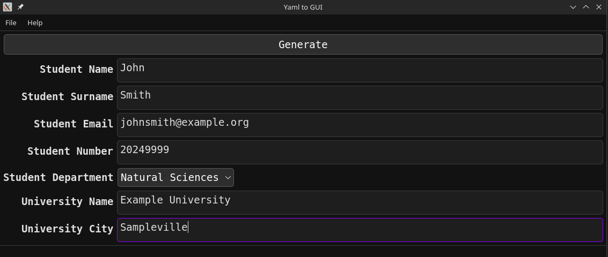

# YAML to GUI
YAML to GUI is a sample Qt Creator application for converting a YAML file to a form.

The YAML file:
 ```yaml
Student:
    Name: string
    Surname: string
    Email: string
    Number: string
    Department:
        - Engineering
        - Business
        - Arts
        - Architecture
        - Natural Sciences
        - Medicine
        - Human Sciences
University:
    Name: string
    City: string
```

Gets converted to:


## Project Tree
```
├── CMakeLists.txt -> Project cmake configuration
├── LICENSE
├── main.cpp -> Code entry point
├── mainwindow.cpp
├── mainwindow.h
├── mainwindow.ui
├── README.md -> You are here!
├── sample.yaml -> Example YAML file.
└── screenshots
```

## Dependencies
- Qt6
- yaml-cpp
- cmake
